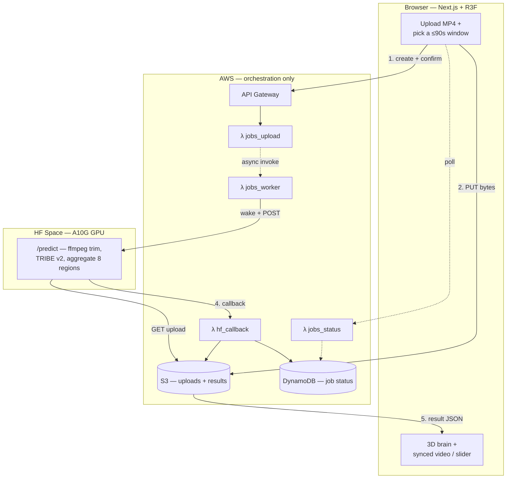

# Neural Media

**Upload a short video, choose a window up to 90 seconds, and watch a 3D brain
light up with the _predicted average human cortical response_ to that clip** — a
non‑invasive, comparative read on what a piece of video does to the visual,
auditory, language, and face‑processing parts of the brain. Built on Meta FAIR's
**[TRIBE v2](https://github.com/facebookresearch/tribe)**.

### ▶︎ Live demo — **https://ddbk4djj9nrdg.cloudfront.net/**

Two ways in:

- **The gallery** — a set of precomputed example clips. Click one and the brain
  animates instantly beside the source video. No waiting, no setup, can't fail.
- **Your own clip** — drop an MP4, pick a ≤90 s window, and it runs **live on a
  real GPU**, then plays your trimmed clip next to its predicted brain on one
  shared timeline.

> _The whole thing is non‑commercial. TRIBE v2 is licensed CC BY‑NC and uses
> Llama 3.2 internally — built with Llama._

<!-- DEMO MEDIA: drop a ~15s screen-capture GIF of the gallery (video + brain +
     slider) here, e.g. . The site is live at the
     link above if you want to record one. -->

---

## Contents

- [What it measures (plainly)](#what-it-measures-plainly)
- [How it works](#how-it-works)
- [The engineering, in depth](#the-engineering-in-depth)
- [Tech stack](#tech-stack)
- [Repository layout](#repository-layout)
- [Running it locally](#running-it-locally)
- [Deploying](#deploying)
- [Performance & cost](#performance--cost)
- [Scientific framing](#scientific-framing)
- [License](#license)

---

## What it measures (plainly)

**Does:** predict the BOLD fMRI response — averaged across TRIBE v2's training
population — at **20,484 points on the cortical surface**
(`fsaverage5`), for the chosen window of a video. Those vertices are aggregated
into **eight well‑localised regions**: early visual **V1–V4**, **auditory**
cortex, the **language** network, the **FFA** (faces), and the **VWFA**
(visual word form / reading).

**Does not:** measure *your* brain, addiction, reward, attention, cognitive
load, "dopamine," or how media is "rewiring" you. It's a population‑average
forward model, so prefer **comparative** claims ("clip A predicts higher V1 than
clip B") over absolute ones. The full constraint list is in
[`docs/scientific-framing.md`](docs/scientific-framing.md).

---

## How it works

The product is **upload‑only**: you give it a local MP4 and a `[start, end)`
window, and only that window is ever analyzed. (An earlier version pasted a
YouTube URL — see [Why upload‑only](#1-why-upload-only-not-a-youtube-link)
below for why that path is retired.)



> _GitHub renders the Mermaid blocks above and below; click a diagram to
> zoom/pan. The model runs on the HF Space GPU — AWS is orchestration only._

**The model runs on the HF Space GPU, never on AWS.** AWS does only the
lightweight orchestration — mint the upload, track status, store and serve the
small result JSON. The exact same Space pipeline is reused offline to **bake the
gallery**, so the precomputed examples are produced by the identical code path
as a live run.

The single source of truth for every request/response shape and validation rule
is [`shared/CONTRACTS.md`](shared/CONTRACTS.md), enforced in both Python
(Pydantic) and TypeScript.

---

## The engineering, in depth

The interesting decisions — most of them forced by real constraints rather than
chosen for fun.

### 1. Why upload‑only (not a YouTube link)

The original design pasted a YouTube URL and let the GPU fetch just the chosen
window with `yt-dlp --download-sections`. It worked locally and **failed in the
cloud**: YouTube serves a `403` to `yt-dlp` from **datacenter IP ranges** (AWS,
HF, GCP). There's no reliable, ToS‑clean way around that, so the live path is
now **upload an MP4** — the browser PUTs the bytes straight to S3 over a
one‑time presigned URL, and the Space fetches them from there. The URL code
(`createUrlJob`, the `jobs_create` Lambda) is kept dormant for a possible future
re‑add behind a server‑side fetch.

### 2. Two surfaces: an instant gallery + a real live path

| | Gallery (`/gallery`) | Live upload (`/`) |
|---|---|---|
| Input | a precomputed example, clicked | your MP4 + a ≤90 s window |
| Compute | baked once, offline | live, on the GPU, on demand |
| Latency | instant | ~2 min warm, ~6 min cold |
| Can it fail? | no — static JSON | best‑effort (needs the Space) |

This split is deliberate: the **gallery is the bulletproof headline demo**
(static JSON + self‑hosted clips on a CDN — it physically can't fail), and the
**live upload proves it's a real system** end to end. For a near‑zero‑traffic
recruiting demo, that's the right trade: never show a broken first impression,
but back it with something genuinely live.

### 3. The GPU is allowed to sleep — and the worker waits it out

A dedicated A10G costs ~$1/hr. For sporadic traffic that's wasteful, so the
Space is configured to **sleep after 5 minutes idle** ($0 while asleep). The
catch: a cold boot takes 1–3 minutes, during which Hugging Face holds the
connection open. The worker Lambda therefore **polls the Space's `/healthz`
until it's actually up (180 s budget) before POSTing the job** — so a recruiter
hitting a cold demo waits through the boot and still gets a result, instead of a
timeout. (This was a real bug: the first version gave the kick a 10 s timeout
and marked perfectly good jobs as failed.)

### 4. Trimming happens server‑side, on the exact window

The browser reads the uploaded file's duration to bound the picker, but the
**Space re‑validates and trims with `ffmpeg` to `[start, end)`** before TRIBE
ever sees it. The model only encodes the seconds you asked for — both a cost
control and the reason the result's `videoDurationSec` is the *window* length,
not the file's.

### 5. One slider drives both the clip and the brain

The result view (and the gallery) play your **local clip trimmed to the window**
beside the live brain, sharing a single transport. `videoSec` is the single
source of truth; the brain's playhead is a rescale of it (the model's fixed‑rate
timepoints overshoot the clip, so the mapping is deliberately not 1:1). The clip
is the user's own `File` via `URL.createObjectURL` — never re‑downloaded.

### 6. Honest progress, no fake percentages

Because a cold run is multi‑minute, a blank "Predicting…" reads as frozen.
Instead the tracker shows a **real‑phase stepper** (Uploaded → Queued → Running
on the GPU → Result), a **per‑second elapsed clock** (JS‑driven, so it ticks
even under reduced motion), and a sweeping indeterminate bar. It deliberately
does **not** claim a sub‑stage ("now transcribing…") the browser can't actually
observe — that would be a lie when the run drifts.

### 7. State survives navigation, for free

The current upload + result live in an **in‑memory store in the root layout**
(`apps/web/lib/session.tsx`), which doesn't unmount on client navigation. Bounce
from the live page to the gallery and back and your result is still there — **no
re‑upload, no re‑inference** — because the `File` and the (small) result JSON
never left the browser. A full reload or a new upload resets it. Zero server
cost.

### 8. Contract‑first across three languages

`shared/` is the spine: `CONTRACTS.md` (prose), `schemas.py` (Pydantic), and
`types.ts` (TypeScript) describe the same shapes. The browser, the Lambdas, and
the Space all validate against them, so a drift in the job shape or the
`ActivationPayload` is caught at the boundary, not in production.

---

## Tech stack

| Layer | Tech |
|---|---|
| **Frontend** | Next.js 15 (App Router, static export), React, TypeScript, **React‑Three‑Fiber / three.js** for the WebGL cortical mesh, Tailwind |
| **Hosting** | S3 + **CloudFront** (static export + a viewer‑request Function for clean URLs) |
| **Orchestration** | **AWS SAM** — HTTP API Gateway, 5 Python **Lambdas** (4 live + a dormant URL one), **DynamoDB** (jobs), **S3** (uploads + results), SSM (callback secret), a billing alarm |
| **GPU inference** | **Hugging Face Space** (Docker SDK, A10G), **FastAPI**, background tasks |
| **Model** | Meta FAIR **TRIBE v2** = LLaMA‑3.2‑3B (text) + V‑JEPA2 (video) + Wav2Vec‑BERT (audio) → `fsaverage5` cortical surface |
| **CI** | GitHub Actions — web typecheck/test, Python tests, `sam validate --lint` |

---

## Repository layout

```
apps/web/             Next.js + R3F frontend
  app/                /  (live upload),  /gallery,  /about
  components/brain/   the 3D cortical mesh, scrubber, region bars, synced viewer
  lib/                api client (api-v2.ts) + the in-memory session store
services/inference/   TRIBE v2 wrapper (mock + real backends) + 8-region aggregation
services/hf-space/    the GPU service: download → ffmpeg trim → TRIBE → callback
services/pipeline/    clip fetch + preprocess helpers (ffmpeg) used by the bake
infra/aws/            AWS SAM template + the 4 Lambdas + tests
shared/               canonical contracts: CONTRACTS.md + schemas.py + types.ts
scripts/              gallery bake + smoke tests (smoke-test-upload.sh, etc.)
docs/                 architecture, scientific framing, deploy + GPU runbooks
```

---

## Running it locally

Prereqs: Node 20+ with `pnpm`, Python 3.11+, and (for the real model) a CUDA GPU.

```bash
# Frontend (mock API by default — the gallery works fully offline)
pnpm install
pnpm --dir apps/web dev               # http://localhost:3000

# Point the web app at a live or local API:
#   apps/web/.env.local →  NEXT_PUBLIC_API_BASE_V2=https://<api>/dev

# Lambda stack — validate + build (no AWS creds needed)
cd infra/aws && sam validate --lint && sam build

# The GPU service runs as a container; see services/hf-space/README.md
```

`make help` lists the common dev tasks. The mock inference backend lets you
exercise the entire browser → API → result flow with **no GPU**.

---

## Deploying

Two independent deploys, both documented in
[`docs/single-video-deploy.md`](docs/single-video-deploy.md):

1. **Frontend** → S3 + CloudFront:
   ```bash
   NEXT_PUBLIC_API_BASE_V2=<api-url> STATIC_EXPORT=1 pnpm --filter @neural-media/web build
   aws s3 sync apps/web/out s3://<bucket> --delete
   aws cloudfront create-invalidation --distribution-id <id> --paths '/*'
   ```
2. **Backend** → AWS + HF Space:
   ```bash
   cd infra/aws && sam build && sam deploy --parameter-overrides "HFSpaceUrl=… FrontendOrigin=…"
   # The Space is a separate git repo pushed to Hugging Face; it needs an
   # HF_TOKEN secret to pull the gated Llama-3.2-3B weights. See the runbook.
   ```

The precomputed gallery is produced by a one‑time offline GPU run —
[`docs/gpu-verification-and-gallery-bake.md`](docs/gpu-verification-and-gallery-bake.md).

---

## Performance & cost

Measured on the deployed A10G, for a short (~10 s) window:

| | Cold start (from sleep) | Warm |
|---|---|---|
| End‑to‑end | **~6 min** (5.5–8) | **~2 min** |
| What dominates | wake (1–3 min) + 17 GB weight load + transcription setup | transcription + video encoding |

The ~90 s of whisper transcription is fixed per job, so **clip length barely
matters** for short clips — each extra second of video adds only ~2–3 s of
compute. **Idle cost is $0** (the Space sleeps); a run is a few cents of GPU.

---

## Scientific framing

This is a forward model of a population average, not a measurement of any
individual. What the predictions do and don't license — and why comparative
claims are the safe ones — is spelled out in
[`docs/scientific-framing.md`](docs/scientific-framing.md). Please read it before
quoting a number.

---

## License

Code and docs: **CC BY‑NC 4.0**, to match the TRIBE v2 weights this project
depends on. **Non‑commercial only.** TRIBE v2 uses Llama 3.2 internally — built
with Llama.
