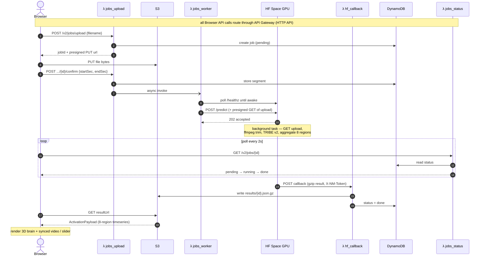
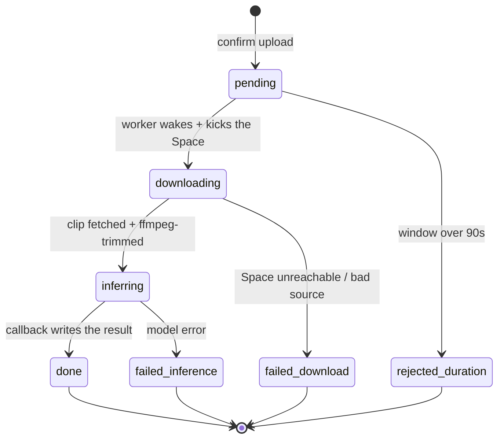

# Neural Media — Architecture

A single‑purpose web app: **upload a short video, pick a ≤90‑second window, and
see the predicted average human cortical response** to that clip, rendered on a
3D brain. One model (Meta FAIR TRIBE v2), two surfaces — a live "run your own
clip" path and a precomputed gallery of examples.

This document is the system‑level deep dive. For the product pitch and the quick
"how it works", start at the [root README](../README.md); for exact request
shapes, [`shared/CONTRACTS.md`](../shared/CONTRACTS.md) is authoritative.

---

## End‑to‑end flow (the live upload path)

A job row exists in DynamoDB from step ① (status `pending`), so the browser
always has an id to poll even if the upload itself fails. Abandoned uploads
evaporate via a 1‑day S3 lifecycle rule; results live 30 days.

## Job status lifecycle

The browser's poll (`GET /v2/jobs/{id}`) walks this state machine:

---

## The two surfaces

| | Live single‑video (`/`) | Gallery (`/gallery`) |
|---|---|---|
| Input | an uploaded MP4 + a chosen `[start, end)` | a precomputed example, clicked |
| Compute | live, on the HF Space GPU, on demand | baked once offline; served as static JSON |
| Latency | ~2 min warm, ~6 min cold | instant |
| Reliability | best‑effort (needs the deployed Space) | can't fail (static) |

The gallery makes the demo bulletproof; the live path proves it's a real system.
Both render through the **same** synced viewer and the **same** `BrainMesh`, and
the gallery's JSON is produced by the **same** Space pipeline run offline — so
there is one code path, exercised two ways.

---

## Where the model runs

TRIBE v2 (**LLaMA‑3.2‑3B** for text, **V‑JEPA2** for video, **Wav2Vec‑BERT** for
audio; ~17 GB of weights) needs a GPU, so it runs on a **Hugging Face Space**,
never on AWS. AWS does only the lightweight orchestration — accept the upload,
track status, store + serve the small result JSON. Llama‑3.2‑3B is a **gated**
model: the Space must carry an `HF_TOKEN` secret to pull it, or `/predict` 401s.

---

## Components

### Frontend — `apps/web` (Next.js + React‑Three‑Fiber)

- **`app/page.tsx`** — the live upload product. A small state machine
  (`idle → tracking → result | error`) drives: a dropzone + duration probe + a
  `[start,end]` picker (≤90 s, bounded by the file length); the
  create→PUT→confirm chain; a 2 s polling loop with a 10‑minute cap; and the
  result view.
- **`lib/session.tsx`** — the state machine *types* + an **in‑memory store**
  mounted in the root layout. Because the layout doesn't unmount on client
  navigation, the current upload + result survive `/ ↔ /gallery` with no
  re‑upload and no re‑inference; a reload resets it.
- **`components/brain/`** — the WebGL stack: `BrainMesh` (the cortical surface,
  camera presets, region tour), `TimelineScrubber`, `RegionBars`, and
  `LiveResultViewer` (live result) / the gallery `Viewer` — both play the clip
  trimmed to the window beside the brain on one shared `videoSec` timeline.
- **`lib/api-v2.ts`** — the typed client for the `/v2/jobs*` endpoints.

### Orchestration — `infra/aws` (SAM, 5 Lambdas)

| Lambda | Role |
|---|---|
| `jobs_upload` | mint a presigned S3 PUT; on `confirm`, store `[start,end]` + async‑invoke the worker |
| `jobs_worker` | wake the Space (`/healthz` poll, cold‑boot tolerant), then `POST /predict` |
| `jobs_status` | the `GET /v2/jobs/{id}` poll endpoint (reads DynamoDB, presigns the result) |
| `hf_callback` | receive the Space's result (auth via `X-NM-Token`), write S3 + flip status |

`jobs_create` (the dormant YouTube‑URL path) also exists but is not wired into
the live UI. Storage: **S3** (one bucket, `uploads/` + `results/` prefixes,
CORS‑scoped to the CloudFront origin) and **DynamoDB** (one row per job, TTL on
`expiresAt`).

### GPU service — `services/hf-space` (Docker + FastAPI)

`POST /predict` returns `202` immediately and runs the pipeline in a background
task: HTTPS‑GET the upload → `ffmpeg` trim to `[start,end)` → TRIBE v2
(`services/inference`) → aggregate 20,484 vertices into 8 regions → POST the
gzipped `ActivationPayload` back to the callback URL. The same module is invoked
offline by the gallery bake.

### Inference core — `services/inference`

The TRIBE wrapper (mock + real backends, real gated behind a `[real]` extra) and
the region aggregation (`aggregate.py`). The mock backend lets the entire
browser → API → result flow run with **no GPU**.

---

## Boundaries (all defined once in `shared/CONTRACTS.md`)

| Boundary | Contract |
|---|---|
| Browser → AWS | `POST /v2/jobs/upload`, `PUT` to S3, `POST .../{id}/confirm`, `GET /v2/jobs/{id}` — §13 |
| Lambda → Space | `POST /predict { jobId, source, startSec, endSec, callbackUrl, callbackToken }` |
| Space → Lambda | callback `{ jobId, status, activationsB64, durationSec, modelVersion }` (header `X-NM-Token`) |
| Space/bake → brain | `ActivationPayload` (`byRegion` timeseries + `timestamps` + `videoDurationSec`) |

`videoDurationSec` is the **analyzed window** (`end − start`), not the file
length. The browser↔S3 transfers are allowed by the results‑bucket CORS rules.

---

## Non‑goals

- Multi‑user / auth / accounts.
- Long videos — the model + cost/latency budget target short stimuli (90 s cap).
- A persistent always‑on GPU — the Space sleeps when idle; the gallery is
  precomputed so the headline demo is always instant.
- YouTube‑by‑URL in the cloud — datacenter IPs are `403`‑blocked by YouTube, so
  the live path is upload‑only (see the README, "Why upload‑only").
